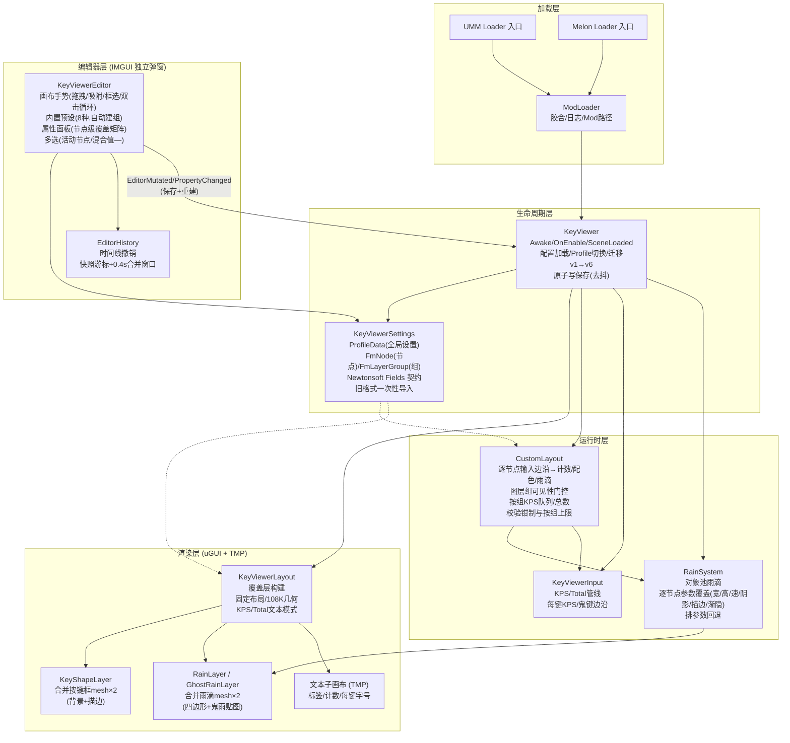
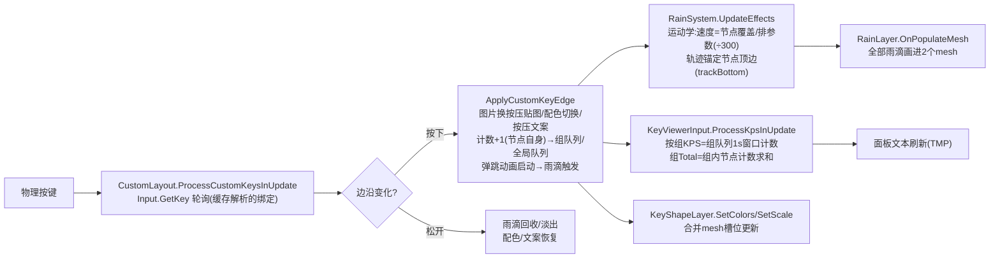

# JipperKeyViewer 项目文档


[](https://github.com/2228293026/JipperKeyViewer/releases/latest)
[](https://github.com/2228293026/JipperKeyViewer/actions/workflows/build.yml)

> 一款适用于《A Dance of Fire and Ice》的按键显示 Mod：实时按键、KPS 统计、雨滴特效，以及完整的 FreeMake 自定义布局编辑器。

## 1. 项目概览

本仓库是一个 C# Mod 工程，包含：

- 双变体 Mod（AssetBundle / FileBased），支持 UnityModManager 与 MelonLoader 双加载器
- 固定布局按键显示（8K–24K / 108 键全键盘 / 脚键 2K–16K）
- FreeMake 自定义布局编辑器（节点式、IMGUI 独立弹窗、内置预设、图层组）
- 合并网格渲染的按键框与雨滴系统（对象池、热路径零 GC）
- 离线数据层回归测试工程（72 项断言）

核心信息：

| 项 | 值 |
|---|---|
| 目标游戏 | A Dance of Fire and Ice（Unity `6000.3.10f1`，Mono 运行时）|
| 语言 | C# 9（LangVersion 9，SDK 风格 csproj）|
| 目标框架 | .NET Framework 4.8.1 |
| 加载器 | UnityModManager 0.33+ / MelonLoader |
| 持久化 | Newtonsoft.Json 13.0.2（游戏自带）+ 运行时 JsonUtility（仅 meta）|
| 界面 | Unity IMGUI（编辑器/设置）+ uGUI/TMP（覆盖层）|
| 许可证 | MIT |

## 2. 环境要求

- **.NET SDK**（构建用；目标框架引用程序集由 csproj 自动还原，无需装 4.8.1 Developer Pack）
- `libs/` 目录下的引用 DLL（游戏托管程序集 + Newtonsoft + 加载器 API）
- （仅 AssetBundle 变体）Unity Editor 6.0.x 重建资源包——`.meta` 固定了精灵边框与 ppu，勿丢失
- Git

## 3. 快速开始

```bash
git clone https://github.com/adofaiex/JipperKeyViewer.git
cd JipperKeyViewer

# 构建 Mod DLL（两变体）
dotnet build JipperKeyViewer/JipperKeyViewer.csproj -c Release
dotnet build JipperKeyViewer-FileBased/JipperKeyViewer-FileBased.csproj -c Release

# 运行数据层回归测试（72 项断言）
dotnet run --project Harness -c Release -- test
```

将 `bin/Release` 产物连同 Loader 入口、`Info.json`、`assets/` 拷入游戏的 `Mods/JipperKeyViewer/` 目录即可（见 §9 安装布局）。

## 4. 目录结构说明

```text
JipperKeyViewer/
├─ JipperKeyViewer/                    # AssetBundle 变体（主工程）
│  └─ KeyViewer/
│     ├─ KeyViewer.cs                  # 生命周期、配置/Profile 管理、版本迁移
│     ├─ KeyViewerSettings.cs          # 数据模型（ProfileData/FmNode/FmLayerGroup）+ Newtonsoft 持久化
│     ├─ KeyViewerLayout.cs            # 覆盖层构建、固定布局、108K 几何、面板文本模式
│     ├─ KeyViewerInput.cs             # 输入轮询、KPS/Total 管线（按组统计）
│     ├─ CustomLayout.cs               # FreeMake 运行时：逐节点输入/计数/配色/雨滴、图层组、校验上限
│     ├─ KeyViewerEditor.cs            # FreeMake 编辑器（IMGUI 弹窗：手势/预设/属性面板）
│     ├─ EditorHistory.cs              # 时间线撤销（快照游标 + 微调合并）
│     ├─ KeyShapeLayer.cs              # 合并按键框 mesh（背景+描边两层）
│     ├─ RainSystem.cs                 # 雨滴模拟（对象池、逐节点参数覆盖）
│     ├─ RawRain.cs                    # 单滴雨滴数据记录与运动学
│     ├─ RainLayer.cs                  # 合并雨滴 mesh（普通四边形 + 鬼雨九宫格贴图）
│     ├─ Key.cs                        # 每键运行时状态
│     ├─ KvImageLoader.cs              # 反射 PNG 加载器（双变体共享）
│     ├─ KeyViewerGUI.cs               # 设置窗口骨架 + 各页 partial：
│     ├─ KeyViewerSettingsGUI.cs       #   布局/显示页
│     ├─ KeyViewerColorGUI.cs          #   配色页、取色器、文本输入缓冲
│     ├─ KeyViewerRainGUI.cs           #   雨线页
│     ├─ KeyViewerBindingGUI.cs        #   按键页（改键/每键文本）
│     ├─ KeyViewerResources.cs         # AssetBundle 资源加载
│     └─ I18n.cs                       # 中/英/韩三语词条
├─ JipperKeyViewer-FileBased/          # 文件变体（通配链接共享源码，自有资源加载）
├─ JipperKeyViewer-Loader.UMM/         # UMM 加载入口
├─ JipperKeyViewer.Loader.Melon/       # Melon 加载入口
├─ JipperKeyViewer-Unity/              # AssetBundle 构建工程（Unity Editor）
├─ JipperKeyViewer-FileBased.Loader.*/ # 文件变体加载入口
├─ Harness/                            # 离线数据层回归测试（反射调用构建产物）
├─ libs/                               # 引用 DLL（游戏程序集/Newtonsoft/加载器）
└─ CHANGELOG.md / 更新日志.md
```

## 5. 包与依赖

- **游戏程序集**：`UnityEngine.*`（CoreModule/UIModule/IMGUIModule/InputLegacyModule/AssetBundleModule 等）、`Assembly-CSharp`、`Unity.TextMeshPro`
- **序列化**：`Newtonsoft.Json`（游戏自带，运行时从 Managed 目录解析；编译期用 libs 副本）
- **加载器 API**：`UnityModManager`、`MelonLoader`、`0Harmony`（仅加载器入口引用，主工程不依赖 Harmony）
- 无 NuGet 运行时依赖；`Microsoft.NETFramework.ReferenceAssemblies` 由 csproj 自动还原

## 6. 脚本分层与核心系统关系图

> 说明：以下是帮助理解代码组织的"工作分层"，用于快速定位，不是强制架构边界。

### 分层说明

- **加载层**：Loader 入口项目（UMM/Melon）→ 注入主 DLL → `ModLoader` 胶合与日志
- **生命周期层**：`KeyViewer`（Awake/Enable/SceneLoaded/Quit；配置加载、Profile 切换、版本迁移 v1→v6）
- **编辑器层**：`KeyViewerEditor`（IMGUI 弹窗）+ `EditorHistory`（撤销栈）——只改数据模型，不直接碰渲染
- **运行时层**：`CustomLayout`（FreeMake 逐节点输入/计数）+ `KeyViewerInput`（KPS/Total 管线）+ `RainSystem`（雨滴模拟）
- **渲染层**：`KeyViewerLayout`（构建覆盖层）+ `KeyShapeLayer` / `RainLayer`（合并 mesh）+ TMP 文本子画布
- **数据层**：`KeyViewerSettings`（ProfileData / FmNode / FmLayerGroup + Newtonsoft Fields 契约）

### 核心系统关系图



### 核心数据流（一次按键，自定义布局）



### 配置持久化流

```text
编辑器操作 / 设置页改动
  → EditorMutated / SaveSettingsFromGui（去抖合并）
  → SyncListsToArrays（列表刷入数组字段）
  → JsonConvert.SerializeObject（Fields 契约 + UnityStructConverter）
  → WriteAllTextSafe（临时文件 + 原子替换）

游戏启动
  → LoadSettings（meta 用 JsonUtility）
  → LoadProfile（Newtonsoft PopulateObject + 旧格式一次性导入）
  → EnsureCustomNodes（NaN 净化 / 钳制 / 按组上限 / 空组剔除）
```

## 7. 模块职责矩阵

| 模块 | 主要职责 | 规模备注 |
|---|---|---|
| `KeyViewerEditor.cs` | 画布手势、预设生成、属性面板、图层组管理 | 最大单文件 |
| `KeyViewerLayout.cs` | 覆盖层构建、108K 槽位表、CreateKey 管线 | 含 105 项槽位表 |
| `CustomLayout.cs` | FreeMake 运行时全部逻辑 | partial，与 Layout 协作 |
| `KeyViewerSettings.cs` | 数据模型 + 序列化 | 字段数最多（FmNode 79 字段）|
| `RainSystem.cs` | 雨滴池/模拟/参数覆盖 | — |
| `EditorHistory.cs` | 撤销栈 | ~100 行 |
| `Harness/` | 回归测试 | 72 断言，反射调用构建产物 |

## 8. FreeMake 编辑器速览

布局页切到**自定义** → **打开 FreeMake 编辑器**。独立浮动窗，改动即时生效。

| 能力 | 说明 |
|---|---|
| 画布 | 拖拽/框选/Ctrl多选/双击循环/八向缩放/小地图/滚轮缩放/右键平移/方向键微调 |
| 吸附 | 节点边/中心 + 屏幕边/中心，屏幕恒定阈值；Alt 临时关闭 |
| 撤销 | Ctrl+Z/Y，含属性修改；连续调整按 0.4s 窗口合并为一步 |
| **内置预设** | 12K/16K/20K/10K/8K/14K/24K/108K；「保存为新配置」（默认，克隆全局设置）或**追加进当前画布**（避让重叠）；继承键位/计数/文本；自动建图层组 |
| **图层组** | 整组显隐（隐藏=不渲染不响应不计数）；**按组 KPS/Total**（组面板只统计本组）；每组一对 KPS/Total；**按组节点预算 112 键类 + 8 图片**；空组自动清理；组名编号复用最小空闲 |
| **节点级覆盖** | 配色六件套（背景/按压背景/描边/按压描边/文本/按压文本）、文本（文案/字号/隐藏文字/隐藏计数）、雨滴形状（宽/高/速/XY偏移/参数排）、雨滴样式（双色渐变/阴影/描边/顶部渐隐/松开淡出）、**鬼雨独立三组**（参数/阴影/描边）、动画（按压缩放/计数弹跳）、面板文本布局（居中/堆叠/仅数值）、其它（深度/锁定/隐藏/鬼键捕获） |
| 多选编辑 | 字段显示活动节点值（画布青色框标注），改动应用全选；值不一致显示 `—`（输入即统一，滑杆直接生效）|
| 图片 | `CustomImages/` 目录或绝对路径；窗口内导入；按压图切换 |

## 9. 安装布局

### UnityModManager（AssetBundle 变体）

```text
UMMMods/JipperKeyViewer/
├── JipperKeyViewer.dll
├── JipperKeyViewer.Loader.UMM.dll      # Info.json 引用的入口
├── Info.json
└── assets/keyviewer_resources
```

### MelonLoader（FileBased 变体）

```text
Mods/JipperKeyViewer-FileBased/
├── JipperKeyViewer-FileBased.dll
├── JipperKeyViewer-FileBased.Loader.Melon.dll
├── Info.json
└── assets/
```

首次启动后创建 `config/`（`settings.json` 元数据 + `profiles/` 每配置一个 JSON，游戏内切换）；`CustomFont/` 放字体，`CustomImages/` 放 FreeMake 图片。

## 10. 发布清单

- [ ] 两变体 `dotnet build -c Release` 0 警告 0 错误
- [ ] `Harness test` 72 断言全绿
- [ ] `AssemblyInfo` 版本号更新，CHANGELOG 中英双语补记
- [ ] AssetBundle 变体：资源包与 `.meta` 边框同步
- [ ] 游戏内冒烟：启动加载 → 固定布局按键 → 自定义布局预设/图层组/雨滴 → 保存重启回读
- [ ] 许可证与致谢段复核

## 11. 常见问题排查

**Profile 变成 `*.corrupt` / 配置丢失**：旧构建的序列化缺陷已修复；新构建遇到不可解析文件会先备份为 `.corrupt` 再回退默认，不会覆盖原件。旧过渡格式（内嵌 JSON 字符串）会自动导入。

**旧版本 Mod 读到 Custom 配置**：按枚举钳制回落 Key16，属预期。

**自定义布局雨滴"没有向上动画"**：逐节点速度与排滑杆同单位；若曾手改配置写入 0/NaN，加载时会自动净化。

**GitHub 推送失败**：网络对 443 的连通性问题，与仓库无关。

## 12. 致谢

- The FreeMake editor's interaction paradigm draws inspiration from DM Note's layout editor and similar community editors. Everything here is an original implementation.
- FreeMake 编辑器的交互范式参考了 DM Note 的布局编辑器及社区同类编辑器，本仓库为原创实现。

## 13. 许可证

- **MIT License** — see [LICENSE](./LICENSE.txt).
